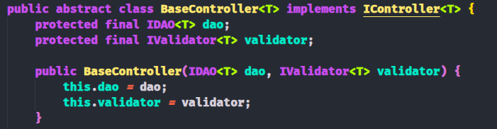

# Projeto de estudo sobre princípios SOLID e arquitetura MVC

Aplicação Java que implementa a arquitetura MVC (Model-View-Controller) e segue os princípios SOLID, em forma de um sistema desktop de gerenciamento de biblioteca para cadastro de livros e autores.

O projeto faz uso intenso de **Interfaces**, **Generics** e **Herança**, gerando uma estrutura modular e desacoplada, de fácil extensão e manutenção.

## Principais Características

- Princípios SOLID
- Arquitetura MVC
- Interfaces
- Injeção de Dependência
- Generics
- Programação Orientada a Objetos

Seguindo o **Dependency Inversion Principle**, todas as dependências entre classes são feitas através de interfaces e injeção de dependência, o que permite a fácil substituição de implementações.

A utilização de **Generics** permite a criação de classes e métodos reutilizáveis.




## Estrutura de Classes

O padrão principal de estrutura de classes consiste em:

- Uma interface que define os métodos a serem implementados.
- Uma classe abstrata que implementa a interface e métodos comuns.
- Duas classes concretas que estendem a classe abstrata e implementam os métodos específicos.

Exemplo de fluxo de herança e implementação:

```
IController(Interface) -> BaseController(Abstrata) -> AuthorController(Classe Concreta)
                                                   -> BookController(Classe Concreta)
```

## Estrutura de Camadas

O projeto é dividido em camadas, seguindo a arquitetura MVC:

1. **View**: Responsável pela interação com o usuário.

2. **Controller**: Gerencia a comunicação entre a View e o Model, em conjunto com o Validator e Service.

3. **Model**: Comporta as Entidades e o acesso aos dados através do DAO (Data Access Object).

4. **Validator**: Responsável pela validação dos dados antes de serem processados ou armazenados.

5. **Service**: Contém métodos auxiliares de lógica de negócio que podem ser reutilizados por diferentes controladores.

## Ferramentas Utilizadas

- Java 17
- Swing Framework para a interface gráfica
- SQLite para o banco de dados
- JDBC para a conexão com o banco de dados
- Maven para gerenciamento de dependências e build
- Conventional Commits Pattern para padronização de mensagens de commit

## Como Executar

1. Clone o repositório:
   ```bash
   git clone https://github.com/SamuelFerreiraDEV/solid-mvc-demonstration.git
   ```
2. Vá para o diretório do projeto:
   ```bash
   cd solid-mvc-demonstration
   ```

3. Instale o Maven caso não tenha:
    ```bash
    sudo apt install maven
    ```
4. Compile o projeto usando Maven:
   ```bash
   mvn clean install
   ```
5. Execute a aplicação:
   ```bash
   mvn exec:java -Dexec.mainClass="projetomvc.Main"
   ```
